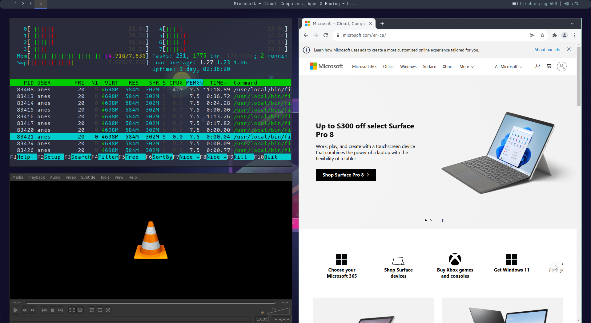

By definition, a desktop environment is simply a graphical user interface (GUI)
that enables the use to interact, manage and access the services of an
operating system.

A desktop environment (DE) is a bundle of different graphical components (such
as toolbar, desktop widgets, icons, etc) and utilities that are presented to
the use instead of the archaic command line interface to interact with the system.

Gnome, KDE, Cinnamon are some of the most popular desktop environment on Linux.

The freedom of a Linux operating system is that you can tweak, replace and
customize your experience provided you know what you're doing.

For example, on Gnome, a popular desktop environment (that Fedora uses as its
default DE) uses `Nautilus` as a its file manager and `Mutter` as a window
manager, if these options don't work for you, well with a little know how you
can change them.

The thing with DE is that they provide their own window managers(Mutter on
Gnome) which bring us to our subject: the i3 window manager.

## Overview

i3WM is a tiling window manager, where the applications' windows are organized into 'tiles'.
i3WM brings a ton of features especially if you're developer:



- Minimal.
- Consumes less resources.
- Keyboard driven navigation.
- Pairs greatly with Vim and Tmux.
- Very Very customizable.

## Installation

It's a good option to have a desktop environment already installed on your
machine, preferably Gnome.

i3WM on its own is useless, so here's my list of packages that we need:

- i3 gaps: a fork of i3WM that provides gaps between the tiles.
- dunst: A lightweight notification deamon.
- rofi: A utility to launch apps (replacement for dmenu).
- xbacklight: is a utility to set our laptop’s screen brightness.
- network-manager-applet: A GUI applet used to configure network connections.
- feh: For setting the wallpaper image.
- polybar: A highly customizable status bar.
- Kitty: Terminal emulator.
- Thunar: A lightweight file manager.
- picom: A lightweight window compositor.

With the list out of the way it's time to install our packages through your
package manager.

I'm on fedora so mine will be `dnf`:

```
$sudo dnf install i3-gaps dunst rofi xbacklight network-manager-applet feh
  polybar kitty thunar picom
```

## Next step

In the next post we'll start with the i3wm configuration along with some of the
utilities we've installed.
